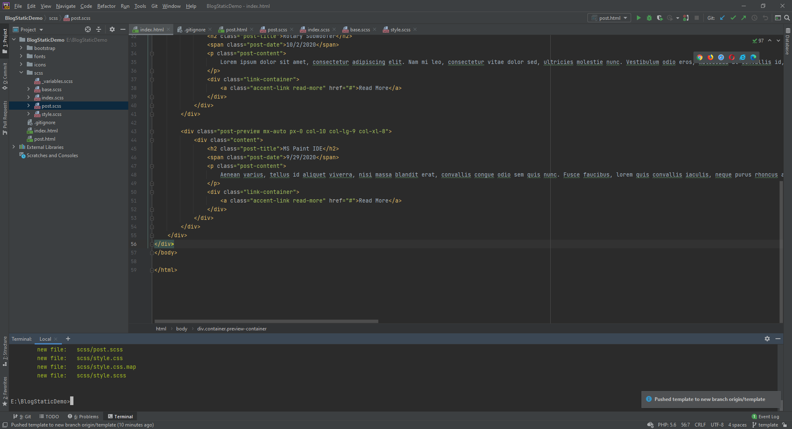

```
title: Some demo
date: 10/4/2020
description: Some meta shit
tags: demo one, demo two
```

This is a test of my blogging software. This is a file simply in a markdown file, and should be templated into a static HTML file in a separate branch. Eventually, **formatting** should be _enabled_.

[//]: <> "End preview"

```Java
System.out.println("This would be cool too")
```

It would also be cool to include images as well, something like



Images should be available also from GitHub, this could be proxied with Cloudflare's caching stuff maybe? I don't know. This is still a huge WIP.